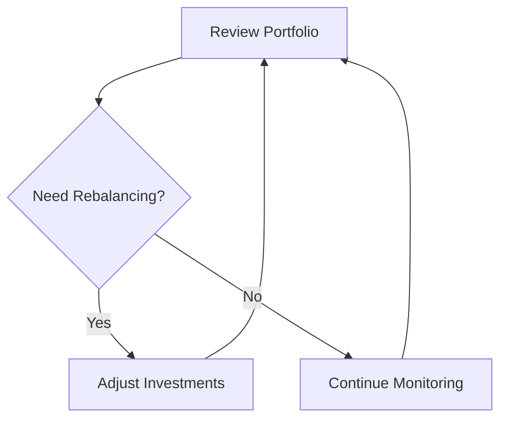

# 5 Essential Tips for First-Time Investors

Investing can seem daunting, especially if you're just starting out. But with the right approach, anyone can begin building wealth through smart investment strategies. Here are five essential tips for first-time investors:

## 1. Start with a Clear Financial Goal

Before you invest a single dollar, it's crucial to define your financial goals. Are you saving for retirement, a down payment on a house, or your child's education? Your goals will influence your investment strategy and time horizon.

## 2. Understand Your Risk Tolerance

Every investment carries some level of risk. As a first-time investor, it's important to understand how much risk you're comfortable with. Generally, younger investors can afford to take on more risk, while those closer to retirement may prefer a more conservative approach.

## 3. Diversify Your Portfolio

{/* You can use MDX components here */}

Diversification is key to managing risk. Spread your investments across different asset classes, such as stocks, bonds, and real estate. Within each asset class, further diversify by investing in various sectors and geographic regions.

## 4. Start with Low-Cost Index Funds

For beginners, low-cost index funds are an excellent way to start investing. These funds provide broad market exposure and don't require you to pick individual stocks. They're also typically less expensive than actively managed funds.

## 5. Regularly Review and Rebalance Your Portfolio

{/* You can even include simple charts or diagrams */}

Your investment needs will change over time. Regularly review your portfolio and rebalance it to ensure it still aligns with your goals and risk tolerance.

Remember, investing is a journey, not a destination. Stay informed, be patient, and don't hesitate to seek advice from financial professionals when needed.

Happy investing!